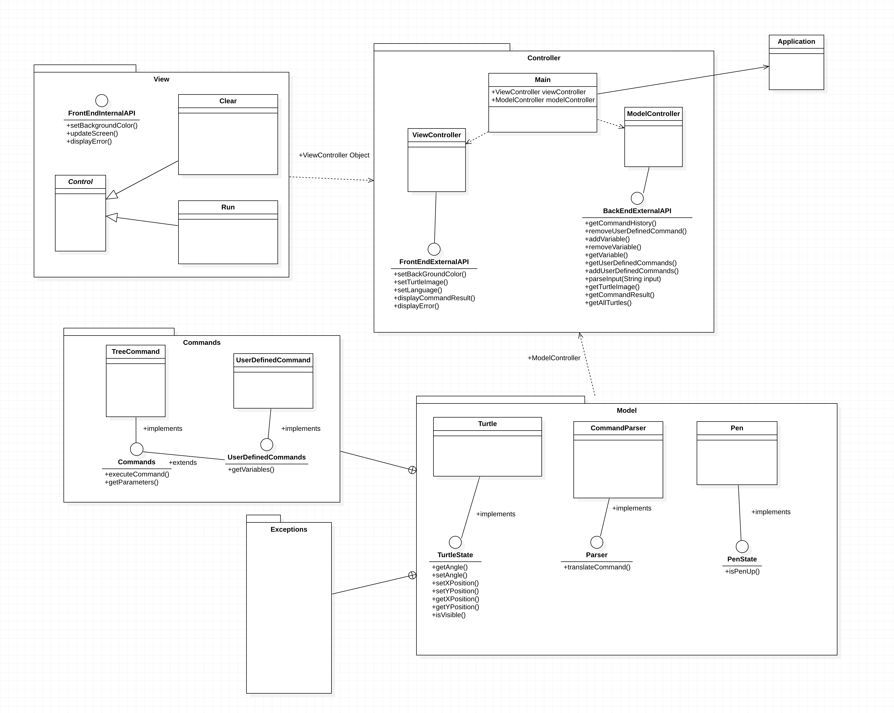
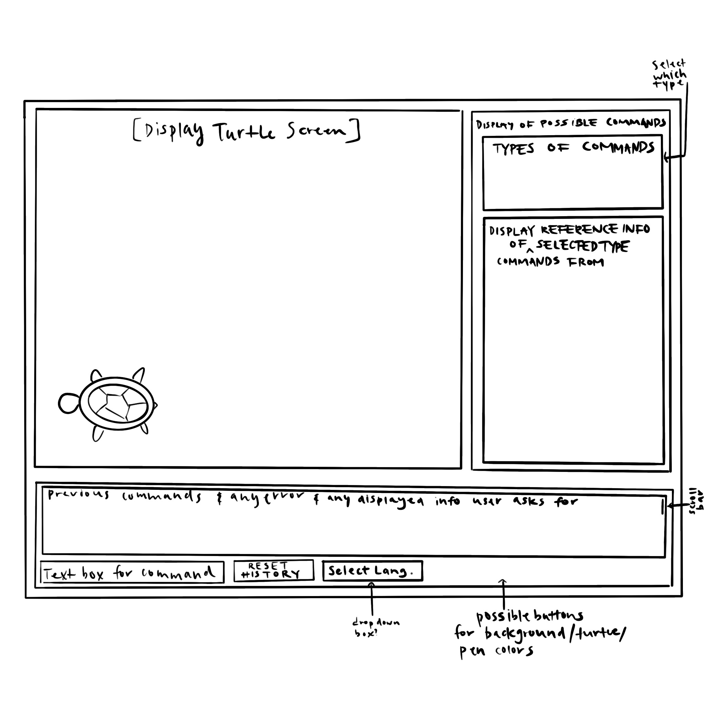

# SLogo Design Plan
### Team Number 
slogo_team01
### Names
- Casey Szilagyi (crs79)
- Jin Cho (jc695)
- Kathleen Chen (kc387)
- Ji Yun Hyo (jh160)

#### Examples

Here is a graphical look at my design:

made from [a tool that generates UML from existing code](http://staruml.io/).

Here is our amazing UI:

taken from [Brilliant Examples of Sketched UI Wireframes and Mock-Ups](https://onextrapixel.com/40-brilliant-examples-of-sketched-ui-wireframes-and-mock-ups/).

## Introduction
The overall design idea is to allow for maximum flexibility while ensuring that each part of the application
can perform its tasks independently of the other parts. 

## Overview

## User Interface

## Design Details

## Test Plan

## Design Considerations

## Team Responsibilities

* Team Member #1

* Team Member #2

* Team Member #3

* Team Member #4