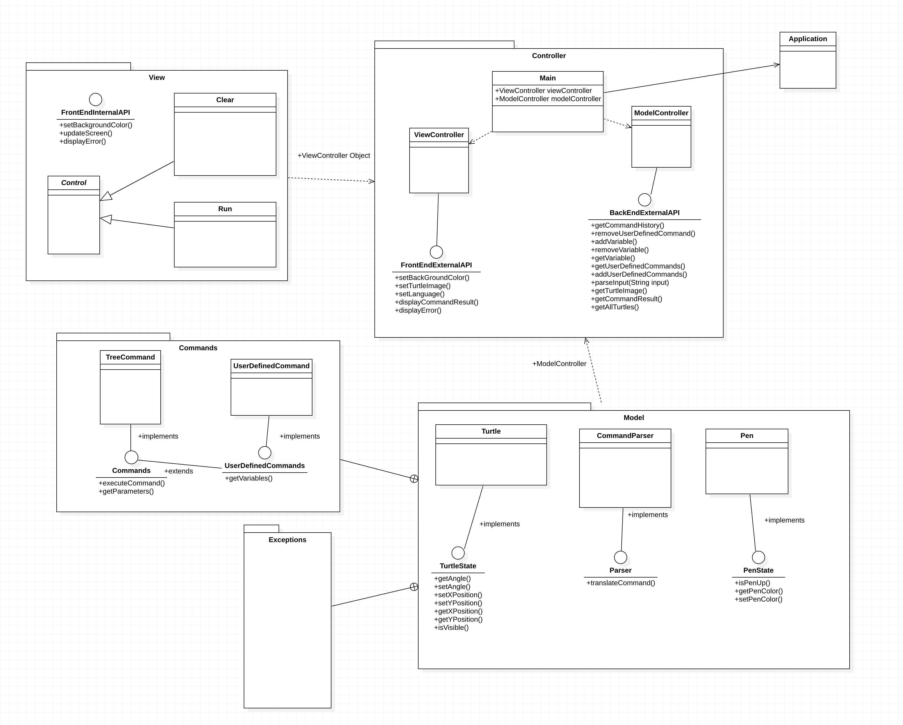

# SLogo Design Plan

### Team Number

slogo_team01

### Names

- Casey Szilagyi (crs79)
- Jin Cho (jc695)
- Kathleen Chen (kc387)
- Ji Yun Hyo (jh160)

## Introduction

The overall design idea is to allow for maximum flexibility while ensuring that each part of the
application can perform its tasks independently of the other parts.

- Will have a controller that interfaces with the model and the view.
    - Ideally, this controller only has to get pen/turtle movement from the model, and then decide
      how to act on it to make it show on the view
        - the movement passed up will not require the backend to know the actual location or
          information about the turtle but rather just the change in location that will be applied
          to the turtle
        - the controller will then go through these movements and translate them to locations for
          the view to use, and in doing so, check the validity of the moves, throwing exceptions if
          the commands are invalid (i.e. off the grid)
    - Additionally, it would have to take a command from the view and give it to the model to use.
        - view will pass it back to the parser in the backend through the controller in a format the
          parser is able to recognize and parse accordingly

- Backend consists of a parser that communicates with the controllers and the objects defined that
  correspond to the command types
    - commands will be defined in a way that they can be executed by breaking down into their
      simpler commands aka the basic turtle or math commands that have been provided
        - these simple commands will be predefined and used by more complex commands

    - backend will be able to execute both pre-defined/selected series of commands and user-defined
      commands in the same way
        - format of command inputted doesn't matter and will be able to deal with any form of
          command

## Overview



- The model will be responsible for parsing through a string with all of the command information
    - This will be turned into a queue of commands to run
        - commands will be "translated" in a way that is understandable by the backend command
          executions (reflect)
    - When a step is taken in the queue, we get a single piece of pen movement information
- The controller will be responsible for converting this pen movement information into the turtle
  movement locations
    - Right now, thinking one pen movement is given to the controller at a time. The rate that this
      happens can be changed in the controller.
    - Each pen movement updates the turtle
- This updated turtle information is passed to the front end and the lines are drawn according to
  the parameters selected in the front end
- Front end will display the turtle movement based on information passed in through controller
- Text box for inputing commands will be in the front end and when a button is pressed, controller
  will pass the command string to the parser to be parsed through

## User Interface

Possible design for user interface:


- pane/frame to display turtle and pen movement
- pane/frame to type commands and store previous commands/errors
- pane/frame that displays possible commands and what they require (like required inputs)
- button for language of code
- buttons for background/pen/turtle style? (might be a command or go in back end?)

## Design Details

- FrontEndInternalAPI
    - Need to be able to add functionality to the front end through this API
        - Need to be able to determine where and at what angle the turtle is at in order to be able
          to implement new features for the turtle
        - Need to have a knowledge of the pens
- FrontEndExternalAPI
    - Has things that someone trying to use the visual display would need to interface with
        - Needs to be able to alter the state of the turtle through the commands
        - Change the color, language, turtle image
- BackEndInternalAPI
    - Needs to have ways to extend the functionality of the core parts of the project
        - Add new commands
        - Parse in different ways
- BackEndExternalAPI
    - If someone theoretically wanted to make a new front end, it would need to be able to interface
      with our back end
        - Therefore, it needs to have commands related to parsing
        - Also needs to be able to control user defined vaaraiables and commands


- Thinking about having a basicCommand interface that is implemented by all the commands
    - This interface will be used for turtle commands like forward, backward, as well as arithmetic
      commands
    - All the more complex user-defined commands are composed of these basic commands

- Take in input and parse through string of commands
    - this parsing will translate the commands all to a common "machine" language recognizable as
      class names for the basic commands
        - foreign language translation
        - FORWARD and FD both "translated" to the same command
- Format into data structure to pass into command class
    - Create a queue to maintain order
    - need to indicate the cases of looping and recursion
- Passed into CommandCreator class that takes in command string data structure and

## Test Plan

The overall goal of the testing plan is to test for all of the different possible commands, and all
of the different possible kinds of bad input

- Have a basic test for each individual basic command, assuming they are spelled and called
  correctly (this part doesn't worry about formatting)
    - For the turtle commands/queries, need to make sure commands are reflected in the turtle and
      that queries always return the result from the turtle that is being used
    - For boolean/math operations, need to verify the validity of the arithmetic and check the
      result
        - Need to check for numbers that are out of the range of an integer/double after performing
          arithmetic (such as for pow and sum), determine what to do if this is the case
        - Need to check for other invalid arithmetic operations (divide by 0, such as tan90)
    - Testing should be complete for these basic commands listed earlier before testing for
      variables, control structures, and user defined commands
        - Will have to test these more complicated commands in every way possible. Will start with
          basic single loops to check repeat, dotimes, and for
        - Will then progress to checking nested loops
            - Will have to consider what happens when very large numbers are put in. Will the
              program work? Need to design with this in mind
            - Nested loops of different types, with some things happening outside of the loop
        - Will also have to check that storing a variable or command name in any location will
          result in it being updated and kept for future use


- All the tests before assume correctly formatted commands. We will also have to design extensive
  tests to check whether the user input is correctly formatted, and tell the user exactly what is
  wrong with their input if it is not.
    - User Input Exceptions
        - Invalid command name
        - Missing command argument
        - Missing punctuation
        - Mismatched/invalid brackets
        - Bad whitespace (not sure if this will be something that needs to be checked based on
          current design)
    - Logic Exceptions
        - Turtle off screen
        - Never ending command loop
        - Command that uses too much memory/can't run (not sure if this would happen, but need to
          keep it in mind)

## Design Considerations

- Need to decide exactly how commands will be stored and given to the front end
    - Thinking some kind of queue that stores a bunch of instances of command objects
    - This queue is passed to the controller, and then each command is passed into the view at a
      certain rate
    - Command info could have information on the Turtle and Pen classes such that the View doesn't
      need to understand what commands are

- How will we store commands
    - All the basic commands will be in their own classes, each one having an execute method
    - User defined commands (which are all combinations of these basic commands) will be stored in
      text files, or taken from the front end
        - Will a user defined comand storage be temporary? Would there be an interface so that users
          could go and delete past commands? Can user define commands be overwritten? These are
          things that we have to consider.

- Parsing through commands
    - Command parser parses through a string representation of the series of basic commands and
      translates them in a way that the Command can create individual BasicCommand objects to
      execute
        - predefined series of commands can be saved in a .txt file that will be scanned and
          formatted into a string for parser
    - commands define loops or recursive calls to its own method:
        - need to be able to recognize the recursion in parsing and translate that accordingly in
          the BasicCommand queue
        - How should we deal with and store repeated commands so that we don't end up having a queue
          of a bunch of repeated commands?
            - command object with an extra variable that keeps track of how many times it/s
              repeated?
            - nested loops?
                - objects that have a list of commands that will repeat and the number of times this
                  series will repeat?
                - this list can also have "repeating commands" object in the list for nested loops?

Trying to figure out exactly what a command is stored in

```java=

// This command class stores a queue of BasicCommand objects. also executes them by calling classes that implement the BasicCommand interface to develop the movement change value queues
public class Command{
    Queue<BasicCommand> commandList;
    Queue<Integer> turtleMovementChanges;
    Queue<Integer> penMovementChanges;
    
    execute();
}

// Predefined basic commands (forward, backward) are defined here. These commands will be translated into pen movement locations
public interface BasicCommand{
    
    execute();
}

```

## Team Responsibilities

* Team Member #1
    * Casey Szilagyi
        * Primarily backend
        * Likely focusing on command implementation

* Team Member #2
    * Kathleen Chen
        * Primarly frontend
        * Focusing on displaying items on the screen
        * Helping with view controller
        * Working with Ji Yun to split work efficiently

* Team Member #3
    * Jin Cho
        * Primarily backend
        * focusing on parsing and communication with the controller

* Team Member #4
    * Jiyun Hyo
        * Primarily frontend
        * Focusing on the view controller
        * Helping with displaying items on screen
        * Working with Kathleen to split the work efficiently (no necessarily hard lines to split
          front end)